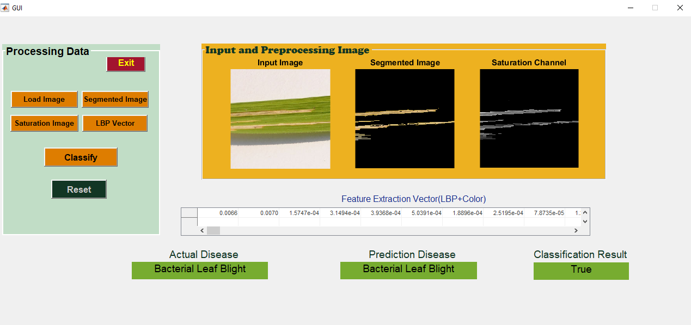

###  Rice Leaf Classification using LBP and Color Feature and SVM 

#### In this Research we succesfuly classify 3 classes of rice leaf disease and get an accuracy of 98.33% in testing in which we use 540 images for training and 120 images for testing. 

#### Here is the output in matlab gui which is displaying how to classify rice leaf disease start from the input image, pre-processing, feature extraction and classification

